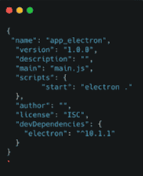
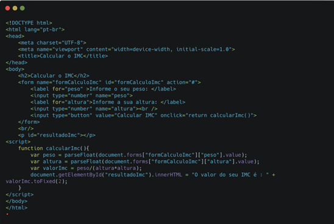

# Guia de instalação do Electron

O que está em amarelo é obrigatório, o que está em cinza é uma alternativa para o comando obrigatório qu está em amarelo OU ele é um comando opcional.
1)	Instalar o node: https://nodejs.org/en/download 

2)	Criar arquivos na mão: main.js e index.html
Você provavelmente já tenha o index.html porque você copiou de um trabalho que fez na disciplina.

3)	Para iniciar o npm, digite no CMD : npm init

4)	Para instalar o electron, digite no CMD: 
Instalação no computador: npm install -g electron
OU
Instalação na pasta do projeto: npm install --save-dev electron

5)	Digitar no CMD para instalar o electron-package que cria os arquivos que rodarão no sistema operacional Windows, MacOS ou Linux: 
npm install electron-packager -g  
npm install -g asar 
OU
npm install electron-package --save-dev
Opcional: atualizar automaticamente quando salva: npm install electron-reload

6)	No package.json, adicionar a dependência:
"scripts": { "start": "electron ." },

7)	No main.js, configurar o tamanho da tela e carregamento da home. Copiar este código:

``
const createWindow = () => {
	const win = new BrowserWindow({
		width: 800,
		height: 600
	})
win.loadFile('index.html')
}
app.whenReady().then(() => {
	createWindow();

	// Para quando a aplicação estiver ativa, mas nenhuma janela está aberta.
	// Comum no MacOS, pois o usuário fecha a janela da app, o que não encerra 
	// a aplicação de fato.
	app.on('activate', () => {
		if (BrowserWindow.getAllWindows().length === 0) 
			createWindow();
	})
})
app.on('window-all-closed', () => {
	if (process.platform !== 'darwin') 
		app.quit();
})

``

Para impedir que o usuário abra o console de ferramentas do Chromium:

``
win.webContents.on("devtools-opened", () => {
    win.webContents.closeDevTools();
});
``

8)	Criar index.html. Exemplo de formulário para calcular IMC:

9)	Iniciar aplicação SEM o executável: npm start    OU     electron main.js

10)	Compilar (criar) aplicação excecutável com electron-package: 
electron-packager "C:\Exercicios\Frameworks\Electron\ElectronComponentesPersonalizados" "Website_WebComponents" --platform=win32 --arch=x64 --electronVersion=24.0.0  --out=dist --overwrite

Para Mac OS:
electron-packager  "C:\Exercicios\Frameworks\Electron\ElectronComponentesPersonalizados" "WebSite_WebComponents" --platform=darwin --arch=x64  --electronVersion=24.0.0  --out=dist --overwrite
OU
electron-packager <pasta_da_aplicação> <nome_da_aplicação> --platform=darwin --arch=x64 --icon=<caminho_do_icone.icns>
OU ocultar o código fonte com --asar:
electron-packager <pasta_da_aplicação> <nome_da_aplicação> --platform=darwin --arch=x64 --icon=<caminho_do_icone.icns> --asar

<pasta_da_aplicação> é o caminho para a pasta raiz da sua aplicação.
<nome_da_aplicação> é o nome que você deseja dar à sua aplicação.
--platform=darwin especifica que você deseja gerar um pacote para macOS.
--arch=x64 especifica que você deseja gerar um pacote para a arquitetura x64 (64 bits).
--icon=<caminho_do_icone.icns> especifica o caminho para o arquivo de ícone a ser usado pela aplicação. O formato de ícone padrão para macOS é .icns.

Exemplo de código: <a href='https://blog.rocketseat.com.br/electron-construindo-aplicacoes-desktop-com-javascript/'>Rockseat construindo aplicacoes desktop com javascript</a>

11)	O executável para MacOS fica na pasta do projeto: \dist\WebSite_WebComponents-darwin-x64\WebSite_WebComponents.app\Contents\MacOS\nomeDoTeuPrograma.arquivo 
O executável para Windows fica na pasta do projeto:  \WebSite_WebComponents-win32-x64\nomeDoTeuPrograma.exe

<a href='https://blog.betrybe.com/framework-de-programacao/electron/'>Betrybe framework de programacao electron</a>
